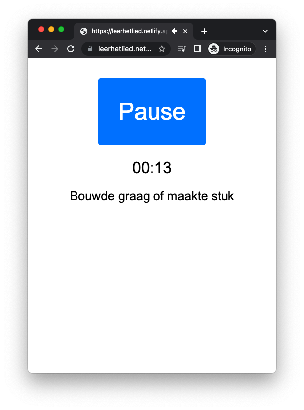

# MP3 Karaoke

Disclaimer: Code & text below are largely generated by ChatGPT.



MP3 Karaoke is a web-based karaoke player that allows you to display lyrics synchronized with an MP3 audio file in a browser. It provides a simple and intuitive interface for users to sing along with their favorite songs and enjoy a karaoke-like experience.

## Features

- **Lyrics Display**: The player displays lyrics in real-time, synchronized with the audio playback.
- **Play/Pause Control**: Users can easily play or pause the audio using a toggle button.
- **Time Tracking**: The current time of the audio playback is shown, allowing users to track their progress within the song.
- **Mobile-Friendly**: The player is designed to be responsive and adapt to different screen sizes, providing an optimal experience on both desktop and mobile devices.

## Usage

1. Clone the repository:

   ```shell
   git clone https://github.com/joost/mp3_karaoke.git
